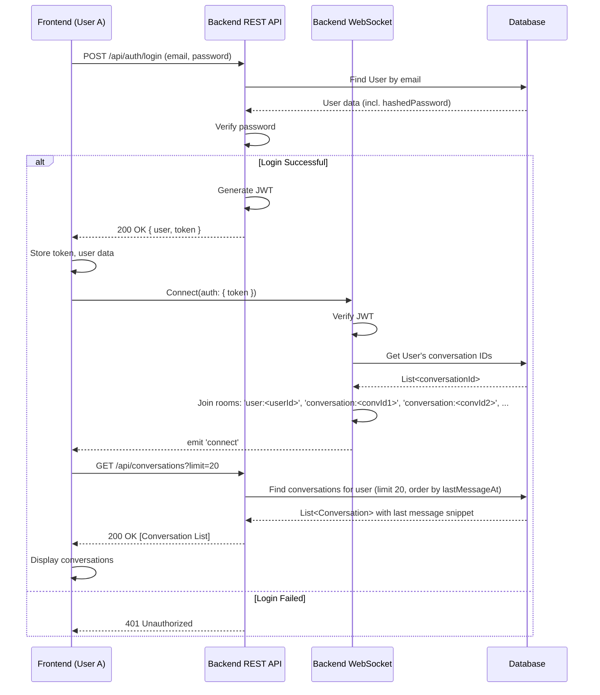
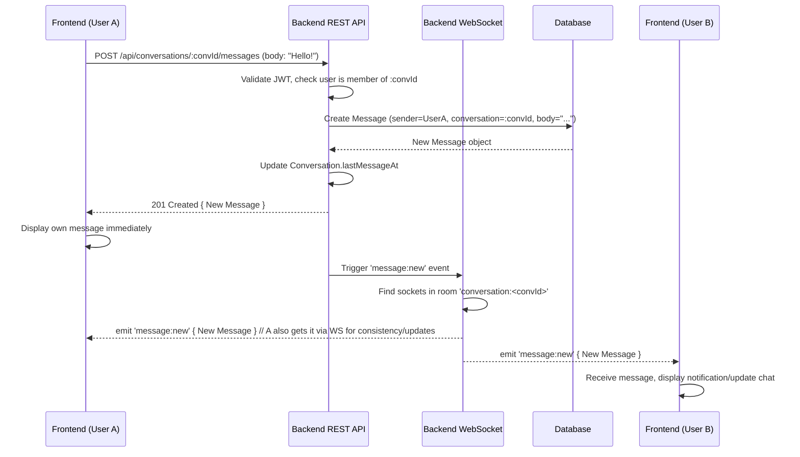
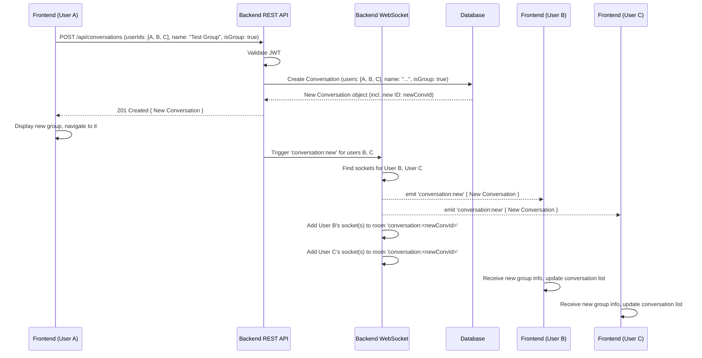
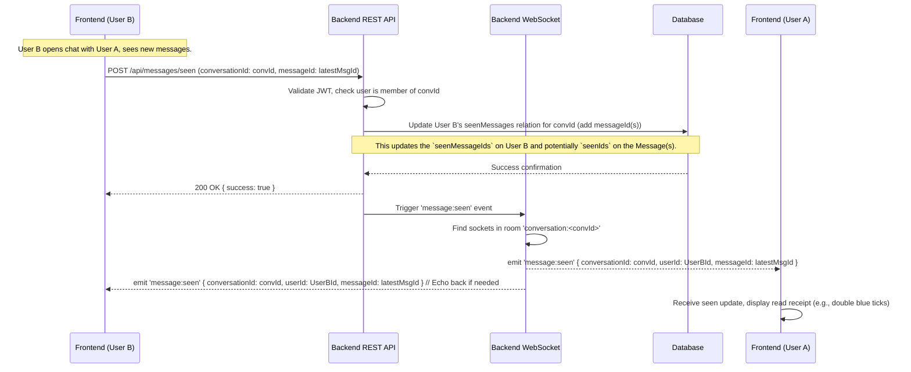

Okay, let's design the API and core flows for your WhatsApp clone based on the requirements and tech stack.

**Core Concepts & Assumptions:**

1.  **Authentication:** JWT tokens will be issued upon successful login/registration and sent with every subsequent authenticated REST API request in the `Authorization: Bearer <token>` header. For Socket.IO, the token will be sent during the initial connection handshake or a dedicated `setup` event to authenticate the socket connection.
2.  **Real-time Communication:** Socket.IO will be used for pushing updates from the server to connected clients (new messages, conversation updates, etc.). Clients will join Socket.IO "rooms" corresponding to their `userId` (for personal notifications) and `conversationId` (for chat-specific events).
3.  **Layered Architecture:** The backend follows Router -> Service -> Repository -> Prisma Model -> MongoDB. This design focuses on the API contract (Router level) and the interaction flows.
4.  **Prisma Schema:** We'll use the provided schema as the basis for database interactions.
5.  **Error Handling:** Assume standard HTTP status codes for errors (400, 401, 403, 404, 500) and consistent JSON error responses.

## I. REST API Endpoints

Here's a proposed set of REST endpoints.

**1. Authentication (`/api/auth`)**

*   `POST /api/auth/register`
    *   **Description:** Registers a new user.
    *   **Request Body:** `{ email, password, name? }`
    *   **Response Body:** `{ user: { id, email, name }, token: "jwt_token" }` (or just the token, login separately) / Error
    *   **Security:** None
*   `POST /api/auth/login`
    *   **Description:** Logs in an existing user.
    *   **Request Body:** `{ email, password }`
    *   **Response Body:** `{ user: { id, email, name, image? }, token: "jwt_token" }` / Error (401 Unauthorized)
    *   **Security:** None
*   **(Optional) OAuth endpoints:** e.g., `GET /api/auth/google`, `GET /api/auth/google/callback`

**2. Users (`/api/users`)**

*   `GET /api/users/me`
    *   **Description:** Gets the profile of the currently logged-in user.
    *   **Response Body:** `{ id, email, name, image?, createdAt, updatedAt }` / Error (401)
    *   **Security:** JWT Required
*   `GET /api/users`
    *   **Description:** Searches for users (e.g., to start a chat or add to a group).
    *   **Query Params:** `?search=<query_string>`
    *   **Response Body:** `[{ id, email, name, image? }, ...]` / Error (401)
    *   **Security:** JWT Required
*   `POST /api/users/block`
    *   **Description:** Blocks another user (Note: Blocking logic needs careful definition - prevent messages? Hide status? This design assumes preventing messages at the API level). The schema doesn't explicitly support blocking; this would require schema modification (e.g., a `blockedUserIds` array on the `User` model or a separate `Block` model). *Assuming schema modification for this feature.*
    *   **Request Body:** `{ userIdToBlock: "user_id" }`
    *   **Response Body:** `{ success: true }` / Error (401, 404)
    *   **Security:** JWT Required
*   `POST /api/users/unblock`
    *   **Description:** Unblocks a previously blocked user.
    *   **Request Body:** `{ userIdToUnblock: "user_id" }`
    *   **Response Body:** `{ success: true }` / Error (401, 404)
    *   **Security:** JWT Required

**3. Conversations (`/api/conversations`)**

*   `GET /api/conversations`
    *   **Description:** Gets the list of conversations for the current user, ordered by `lastMessageAt` descending. Implements requirement #8 (limited to 20 by default, could add pagination).
    *   **Query Params:** `?limit=20` (default), `?offset=0` (optional pagination)
    *   **Response Body:** `[ { id, name?, isGroup, lastMessageAt, users: [ {id, name, image?} ], lastMessage: { id, body?, image?, createdAt, senderId }? }, ... ]` / Error (401)
    *   **Security:** JWT Required
*   `POST /api/conversations`
    *   **Description:** Creates a new conversation (either 1-on-1 or group). The server should check if a 1-on-1 conversation between the users already exists and return that if it does. Implements requirement #2 (implicitly by creating convo) & #3.
    *   **Request Body (1-on-1):** `{ userId: "other_user_id" }`
    *   **Request Body (Group):** `{ userIds: ["user_id_1", "user_id_2", ...], name: "Group Name", isGroup: true }` (userIds should include the creator)
    *   **Response Body:** `{ id, name?, isGroup, createdAt, lastMessageAt, users: [...], messages: [] }` (the new conversation object) / Error (400, 401)
    *   **Security:** JWT Required
    *   **Real-time:** Emits `conversation:new` via Socket.IO to added users.
*   `GET /api/conversations/:conversationId`
    *   **Description:** Gets details for a specific conversation (e.g., full member list). Implements requirement #6 (implicitly, by being able to fetch group details).
    *   **Response Body:** `{ id, name?, isGroup, createdAt, lastMessageAt, users: [ {id, name, image?} ], messages: [...] }` (potentially paginated messages) / Error (401, 403, 404)
    *   **Security:** JWT Required (User must be a member)
*   `POST /api/conversations/:conversationId/leave`
    *   **Description:** Allows the current user to leave a group conversation. Implements requirement #5.
    *   **Response Body:** `{ success: true }` / Error (400, 401, 403, 404)
    *   **Security:** JWT Required (User must be a member, cannot leave 1-on-1)
    *   **Real-time:** Emits `conversation:update` or `member:left` via Socket.IO to remaining members.
*   `POST /api/conversations/:conversationId/add`
    *   **Description:** Adds users to an existing group conversation. Part of requirement #3.
    *   **Request Body:** `{ userIds: ["user_id_to_add_1", ...] }`
    *   **Response Body:** `{ id, name?, isGroup, ..., users: [...] }` (updated conversation) / Error (400, 401, 403, 404)
    *   **Security:** JWT Required (User must be a member, maybe admin in future)
    *   **Real-time:** Emits `conversation:new` to added users, `conversation:update` or `member:joined` to existing members.
*   **(Optional) PUT /api/conversations/:conversationId`**
    *   **Description:** Updates group details (e.g., name, image).
    *   **Request Body:** `{ name?: "New Group Name", image?: "new_image_url" }`
    *   **Response Body:** Updated conversation object / Error
    *   **Security:** JWT Required (User must be member/admin)
    *   **Real-time:** Emits `conversation:update` to all members.

**4. Messages (`/api/messages`)**

*   `GET /api/conversations/:conversationId/messages`
    *   **Description:** Gets messages for a specific conversation (paginated).
    *   **Query Params:** `?limit=50` (default), `?cursor=<message_id>` (for cursor-based pagination) or `?offset=...`
    *   **Response Body:** `{ messages: [ { id, body?, image?, createdAt, sender: {id, name, image?}, seenBy: [{id, name}] }, ... ], nextCursor: "next_message_id"? }` / Error (401, 403, 404)
    *   **Security:** JWT Required (User must be a member)
*   `POST /api/conversations/:conversationId/messages`
    *   **Description:** Sends a new message to a conversation. Implements requirement #2 & #4.
    *   **Request Body:** `{ body?: "Message text", image?: "image_url" }`
    *   **Response Body:** `{ id, body?, image?, createdAt, sender: {id, name, image?}, conversationId, seenBy: [] }` (the newly created message) / Error (400, 401, 403, 404)
    *   **Security:** JWT Required (User must be a member, not blocked by recipient if 1-on-1, check if sender blocked recipient too).
    *   **Real-time:** Emits `message:new` via Socket.IO to the conversation room.
*   `POST /api/messages/seen`
    *   **Description:** Marks messages within a conversation as seen by the current user. (Could potentially be a single latest message ID).
    *   **Request Body:** `{ conversationId: "conv_id", messageId: "last_message_id_seen" }` (or `messageIds: ["id1", "id2"]`)
    *   **Response Body:** `{ success: true }` / Error (401, 403, 404)
    *   **Security:** JWT Required (User must be a member)
    *   **Real-time:** Emits `message:seen` via Socket.IO to the conversation room.

## II. Socket.IO Events

**Server Emits -> Client Listens**

*   `connect`: (Built-in) Client successfully connected.
*   `disconnect`: (Built-in) Client disconnected.
*   `message:new`
    *   **Description:** Notifies clients in a specific conversation room that a new message has arrived.
    *   **Payload:** The full Message object (including sender details, conversation ID). `{ id, body?, image?, createdAt, sender: {id, name, image?}, conversationId, seenBy: [] }`
    *   **Room:** `conversation:<conversationId>`
*   `conversation:new`
    *   **Description:** Notifies a user they have been added to a new conversation (or a new conversation they initiated was created).
    *   **Payload:** The full Conversation object (including users, potentially last message if applicable). `{ id, name?, isGroup, createdAt, lastMessageAt, users: [...], messages: [...] }`
    *   **Room:** `user:<userId>` (for each user added)
*   `conversation:update`
    *   **Description:** Notifies members of a conversation that its details (name, members) have changed.
    *   **Payload:** Updated Conversation object or specific update details (e.g., `{ conversationId: "...", updatedFields: { name: "New Name" } }`, `{ conversationId: "...", memberJoined: { id, name, image? } }`, `{ conversationId: "...", memberLeft: { id } }`)
    *   **Room:** `conversation:<conversationId>`
*   `message:seen`
    *   **Description:** Notifies clients in a conversation room that a user has seen messages up to a certain point.
    *   **Payload:** `{ conversationId: "conv_id", userId: "user_who_saw", messageId: "last_message_id_seen" }` (or timestamp)
    *   **Room:** `conversation:<conversationId>`
*   `(Optional) user:typing`
    *   **Description:** Notifies others in the room that a user is typing.
    *   **Payload:** `{ conversationId: "conv_id", userId: "user_typing_id", isTyping: true }`
    *   **Room:** `conversation:<conversationId>`
*   `(Optional) user:stopped_typing`
    *   **Description:** Notifies others the user stopped typing.
    *   **Payload:** `{ conversationId: "conv_id", userId: "user_typing_id", isTyping: false }`
    *   **Room:** `conversation:<conversationId>`

**Client Emits -> Server Listens**

*   `connection`: (Built-in) Client attempts connection. Needs to handle authentication.
    *   **Authentication:** Pass JWT via `auth` option in the client's Socket.IO connection options: `io({ auth: { token: "jwt_token" } })`. The server verifies this on connection.
*   `setup`
    *   **Description:** (Alternative/Additional Auth) Client sends after connection to confirm identity and signal readiness. Server uses this to associate `socket.id` with `userId` and join appropriate rooms.
    *   **Payload:** `{ token: "jwt_token" }` (if not sent in connection auth) or just `{ userId: "user_id" }` if authenticated via connection.
*   `disconnecting`: (Built-in) Client is disconnecting. Server can perform cleanup (e.g., leave rooms, update presence).
*   `message:seen` (Alternative to REST)
    *   **Description:** Client informs the server they have seen messages.
    *   **Payload:** `{ conversationId: "conv_id", messageId: "last_message_id_seen" }`
*   `(Optional) typing:start`
    *   **Description:** Client indicates they started typing in a conversation.
    *   **Payload:** `{ conversationId: "conv_id" }`
*   `(Optional) typing:stop`
    *   **Description:** Client indicates they stopped typing.
    *   **Payload:** `{ conversationId: "conv_id" }`

## III. Sequence Diagrams

Let's illustrate some key flows:

**1. User Login and Initial Setup**

**2. User Sends a Message (1-on-1)**

**3. User Creates a New Group**

**4. User Marks Messages as Seen**

This design provides a solid foundation covering the requirements, separating concerns between REST and WebSockets, and leveraging the specified tech stack. Remember to implement robust error handling and authorization checks at each step in the backend.